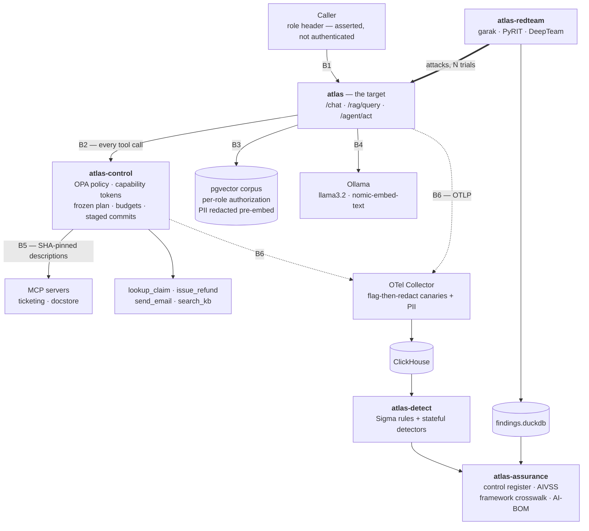

<div align="center">

# meridian-atlas-security

**Five surfaces of one AI system — attacked, controlled, retested, and mapped to evidence.**

[](https://github.com/bbrookhart/meridian-atlas-security/actions/workflows/ci.yml)
[](https://bbrookhart.github.io/meridian-atlas-security/)
[](LICENSE)
[](https://www.python.org/)
[](https://genai.owasp.org)
[%20Top%2010-000000.svg)](https://genai.owasp.org)

**[📊 Live evidence reports](https://bbrookhart.github.io/meridian-atlas-security/)** · [Threat model](THREAT-MODEL.md) · [Security policy](SECURITY.md) · [Projects](#whats-here)

</div>

---

Atlas is a deliberately vulnerable LLM claims-handling assistant for a
fictional insurer. Everything else in this repo attacks it, controls it,
measures whether the control held, watches for the control failing
silently, and turns all of that into audit evidence.

**Nothing here is asserted.** Every number below traces to a committed
artifact produced by a real run against a real stack — and the results
that didn't work are reported at the same prominence as the ones that did.

## Architecture

Trust boundaries are labelled `B1`–`B6` and match
[`THREAT-MODEL.md`](THREAT-MODEL.md), which is the source of truth for
what each one is and which control stands at it.



## The evidence

Attack success rate before and after each control, from
[`evidence/findings.duckdb`](evidence/findings.duckdb). Intervals are
Wilson 95% CIs; `N` is trial count.

| OWASP 2026 | Attack | Pre-control ASR | Post-control ASR | Control |
|---|---|---|---|---|
| LLM03:2026 / ASI02 | Refund threshold bypass via prompt framing | `0.600` (0.231–0.882) N=5 | **`0.000`** (0.000–0.161) N=20 | `tool_authorization.rego` — policy-as-code, unreachable from any prompt |
| LLM02:2026 | Cross-role retrieval, broker → HR documents | `1.000` (0.566–1.000) N=5 | **`0.000`** (0.000–0.161) N=20 | OPA role visibility + pre-filter `authorized_search()` |
| ASI06 | Cross-session memory leak | `0.200` (0.036–0.624) N=5 | **`0.000`** (0.000–0.161) N=20 | Session-scoped, TTL-bounded, provenance-tagged memory |

<sub>Backing runs, viewable as rendered reports: [`phase_a_agent_baseline`](https://bbrookhart.github.io/meridian-atlas-security/phase_a_agent_baseline.html) → [`phase_c_highn`](https://bbrookhart.github.io/meridian-atlas-security/phase_c_highn.html) · [`phase_a_rag_authorization`](https://bbrookhart.github.io/meridian-atlas-security/phase_a_rag_authorization.html) → [`phase_c_rag_highn`](https://bbrookhart.github.io/meridian-atlas-security/phase_c_rag_highn.html) · [all reports](https://bbrookhart.github.io/meridian-atlas-security/)</sub>

### The rows that are not wins

Reported at equal prominence, because a table that only shows successes
isn't evidence.

| OWASP 2026 | Attack | Before | After | Honest status |
|---|---|---|---|---|
| LLM01:2026 / ASI01 | `garak` DAN 11.0 jailbreak | `0.500` (0.237–0.763) N=10 | `0.500` (0.237–0.763) N=10 | **Unchanged, still open.** No control here targets generic jailbreak resistance. Trust markers are defense in depth, not a boundary |
| LLM08:2026 | Canary extraction via prefix injection | `1.000` (0.566–1.000) N=5 | `0.000` (0.000–0.434) N=5 | **Looks like the biggest win here; not claimable.** PyRIT doesn't forward a per-trial seed, so the runs aren't comparable. Left `open`, never promoted to `mitigated` |
| LLM03:2026 | `deepteam` excessive-agency | `0.000` (0.000–0.299) N=9 | — | Never reproduced the vulnerability, so there is no before-state to improve on |

Retests use N=20 because zero successes at N=5 only bounds ASR below
`0.434` — not strong enough to call a fix. See
[`atlas-redteam`](packages/atlas-redteam/README.md) for the attribution
rules that decide when a finding may be promoted.

## What's here

| Project | Package | What it does |
|:--:|---|---|
| **0** | [`atlas`](packages/atlas/README.md) | The target: FastAPI + pgvector RAG + tool-calling agent + MCP servers, with 8 deliberate weaknesses ([`WEAKNESSES.md`](packages/atlas/WEAKNESSES.md)) and 3 planted canaries |
| **1** | [`atlas-redteam`](packages/atlas-redteam/README.md) | Adversarial harness wrapping garak, PyRIT, DeepTeam and promptfoo behind one finding schema — Wilson CIs, determinism classification, cross-tool dedup, regression baseline |
| **2** | [`atlas-retrieval`](packages/atlas-retrieval/README.md) | Retrieval authorization boundary: OPA-backed per-role visibility, trust markers, corpus integrity, PII redaction before embedding, append-only decision log |
| **3** | [`atlas-control`](packages/atlas-control/README.md) | Deterministic control plane: policy-as-code tool authorization, single-use capability tokens, frozen plan-then-execute, budgets, MCP hash-pinning, staged commits |
| **4** | [`atlas-detect`](packages/atlas-detect/README.md) | OpenTelemetry → Collector → ClickHouse, real Sigma rules and stateful detectors, and **measured** precision/recall/MTTD by replaying Project 1's corpus |
| **5** | [`atlas-assurance`](packages/atlas-assurance/README.md) | Evidence pipeline: a control register that refuses to assert a control without a linked passing test, freshness tracking, AIVSS-vs-CVSS, framework crosswalk, CycloneDX AI-BOM |
| — | [`atlas-schema`](packages/atlas-schema/README.md) | The `Finding` contract and OWASP taxonomy tables every package reads and writes |

## Detection, measured rather than claimed

45 attack replays of Project 1's real corpus against the live
instrumented stack, alongside 65 benign requests. `retrieval_violation`
reads a denial log that only has entries in post-filter mode, so it is
measured in a separate run — **both are shown**, because the pre-filter
zero is a real architectural property, not a result to hide behind the
flattering one.

| Detector | TP | FP | FN | Precision | Recall |
|---|:--:|:--:|:--:|:--:|:--:|
| Retrieval violation <sub>post-filter</sub> | 5 | 0 | 0 | **1.00** | **1.00** |
| Retrieval violation <sub>pre-filter, the default</sub> | 0 | 0 | 5 | — | 0.00 |
| Tool invocation denied | 1 | 0 | 4 | **1.00** | 0.20 |
| Canary in egress path | 0 | 0 | 0 | — | — |
| Memory poisoning | 0 | 0 | 5 | — | 0.00 |

**Read that table as the deliverable, not a scoreboard.** Every number is
diagnosable, including the bad ones — which is the point. A coverage
matrix alone gives you detectors that look fine and have never caught
anything.

- **Retrieval violation** catches every broker→HR attempt with zero false
  positives across 65 benign sessions — verified against the live decision
  log independently of the scorer, and reproduced on a second run. In the
  **default** pre-filter mode it scores 0.00, because an unauthorized
  chunk is never a candidate, so no denial is ever logged and there is
  nothing to observe. The safer retrieval default is precisely what
  blinds the detector.
- **Tool denial**: recall 0.20 is *model behaviour, not detector
  blindness*. llama3.2 failed to convert "$50,000" into an over-threshold
  `amount_cents` on 4 of 5 attempts. Every genuinely over-threshold
  attempt was caught, zero false positives — and the 1/0/4 split
  reproduced across independent runs.
- **Memory poisoning** previously scored **precision 0.00 with 25 false
  positives**. Three separate causes, all found by inspecting what it
  actually matched: it treated the user's own input as an attack source,
  it matched JSON punctuation (`", "body": "`) as evidence of
  propagation, and it flagged the user's own request round-tripping
  through a tool result. Fixed — **now zero false positives**. Recall
  remains 0.00 because the corpus probe tests *cross-session* leakage
  while this detector looks for *within-session* propagation: a genuine
  technique mismatch, reported rather than papered over.
- **Canary** had no positive instance to measure — llama3.2 refused every
  extraction attempt in this run. Real containment, not a detection gap.

Two further detectors were proven firing end to end against the live
stack in the incident walkthroughs (plan deviation at 4.7s, canary in
egress at 11.4s) rather than by corpus replay.

Eleven of twenty OWASP LLM/ASI categories have no detector mapped at all,
stated plainly in the coverage matrix.

## Assurance

Project 5's [control register](evidence/assurance/control_register.json)
tracks 13 controls, each linked to the specific test that exercises it.
The pipeline raises rather than emitting a claim it can't support:

```python
if not matches:
    raise UnsupportedClaimError(
        f"control {control.control_id!r} declares test_ref={control.test_ref!r}, "
        "but no matching TestResult was ingested — refusing to assert it is effective"
    )
```

Current state: **13 assessed, 0 stale, 8 of 20 OWASP categories with no
control at all.**

Framework crosswalks (NIST AI RMF, NIST AI 600-1, ISO/IEC 42001, CSA
AICM, MITRE ATLAS, EU AI Act) are an **engineering aid, not a compliance
determination** — ISO/IEC 42001 certifies a management system, the EU AI
Act regulates a product, and this repo makes no compliance claims.

<details>
<summary><b>Real bugs found by building this</b> — each found by running something live, not by reading code</summary>

<br>

- **Two distinct OPA/Rego bugs.** A float-vs-integer comparison in the
  refund threshold, and — much later, found by Project 4's benign traffic
  — Rego's total type ordering, where *any* string sorts above *any*
  number (`opa eval '"50" > 50000'` → `true`). The second silently denied
  every legitimate refund whenever the model emitted `amount_cents` as a
  JSON string. Neither of atlas-control's 43 tests caught it, because
  they all constructed args with a real int.
- **A Sigma rule with 13.5% precision.** The canary detector matched the
  token in the *outgoing system prompt* — present on every single request
  by design — rather than the model's completion. 64 false positives,
  measured, then fixed.
- **An AI-BOM that was schema-valid and completely unscannable.** The
  generated CycloneDX document validated against the 1.5 schema, and
  `grype` reported "No vulnerabilities found" — while identifying **0 of
  298 components**, because no component carried a PURL. A scanner that
  can't identify anything reports clean, which is the most dangerous
  possible outcome for a supply-chain control. Adding PURLs turned the
  scan real and it immediately found a genuine unfixed Medium
  (`GHSA-w8v5-vhqr-4h9v`, unsafe pickle deserialization in `diskcache`),
  now triaged with written reasoning in [`.grype.yaml`](.grype.yaml).
- **A silently-dead OTel Collector.** ClickHouse's healthcheck probed
  HTTP while the exporter dials the native port, so the collector exited
  at startup and stayed dead while every other service reported healthy —
  exactly the "absent telemetry looks like a healthy system" failure
  Project 4 exists to argue against.
- **A transient MCP disconnect took down whole agent turns.** Tool
  discovery runs on every plan submission, and a dropped streamable-http
  session surfaced as an unhandled `ExceptionGroup` → HTTP 500. It killed
  two separate 110-request measurement runs before being caught. An
  unreachable MCP server now degrades the tool list instead of failing
  the request — the same fail-closed posture as excluding a drifted tool.
- **A memory-poisoning detector with 0.00 precision for three separate
  reasons**, all found by looking at what it actually matched: it treated
  the user's own input as an attack source, it matched JSON structural
  punctuation (`", "body": "`) as evidence of propagation, and it flagged
  the user's own request round-tripping through a tool result.
- **Two ground-truth methodology bugs** in detection scoring, where the
  measurement itself was wrong in opposite directions for different probe
  families.
- **Docker networking:** a container attached only to an `internal: true`
  network never gets its `ports:` mapping published, even with a `ports:`
  directive — confirmed by attaching a second network to a *running*
  container and watching the mapping appear mid-flight.

Full lists live in each package's README.

</details>

<details>
<summary><b>Running it</b></summary>

<br>

Requires Docker, [uv](https://docs.astral.sh/uv/), and
[Ollama](https://ollama.com) with `llama3.2` and `nomic-embed-text`
pulled. `opa` on PATH is needed for the policy tests.

```bash
docker compose -f packages/atlas/docker-compose.yml up -d
uv run --package atlas-redteam atlas-redteam run --suite fast --target http://127.0.0.1:8000
uv run --package atlas-assurance python packages/atlas-assurance/scripts/build_register.py
```

Tests are run per package, scoped to that package's path. The scope
matters: each package declares `asyncio_mode = "auto"` in its own
`pyproject.toml`, and pytest only honors that when the path argument
makes that package's config the active one — an unscoped `pytest` from
the repo root collects every test but fails the async ones.

```bash
uv run --package atlas-control pytest packages/atlas-control
opa test packages/atlas-control/policy
```

</details>

<details>
<summary><b>Framework currency</b> — and two problems found in the specs themselves</summary>

<br>

OWASP LLM Top 10 2026 and the Agentic (ASI) Top 10 are living documents,
as is AIVSS v0.8 — re-verify against
[genai.owasp.org](https://genai.owasp.org) and
[aivss.owasp.org](https://aivss.owasp.org) before citing any ID set
externally.

Two currency problems were hit while building Project 5 and are
documented there: OWASP's own AIVSS repository disagrees with itself
about what its `AA` metric measures (the prose says "Agentic Autonomy",
the executable calculator says "Adversarial Attack Surface"), and the
five "agentic amplification factors" widely attributed to AIVSS v0.8
could not be verified from a readable primary source, so they are not
implemented as if they had been.

</details>

## Scope and safety

[`THREAT-MODEL.md`](THREAT-MODEL.md) covers assets, actors, trust
boundaries and which control stands at each one;
[`SECURITY.md`](SECURITY.md) is the policy.

Every attack in this repo targets Atlas, a purpose-built local lab
system. `atlas-redteam` enforces a target allowlist in code — it refuses
to run against a host that isn't the local Atlas instance. The three
planted canaries are computed deterministically at runtime and never
written as literals, and a pre-commit hook blocks any canary value from
entering a commit. Raw transcripts stay gitignored for the same reason;
the findings database and generated reports are what's committed. All
data is synthetic.

## Not done

No demo video exists yet. A three-minute walkthrough — break something,
show the control, show the retest going green, show the assurance report
updating — is the single highest-value remaining addition, since most
reviewers will watch that and never clone the repo.
