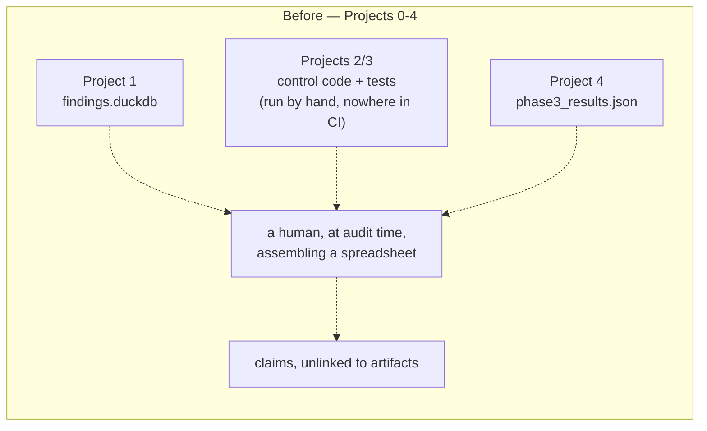
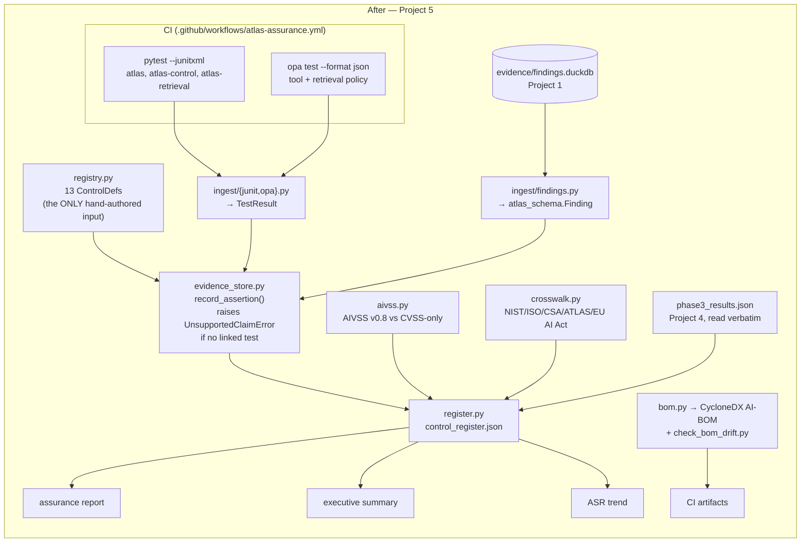

# atlas-assurance

Project 5 of the `meridian-atlas-security` portfolio, and the one that
doesn't attack or defend anything. Its thesis, from the master prompt:
*evidence is generated by CI, not written by hand. A governance
spreadsheet is a claim. A pipeline where every control assertion links to
a `run_id`, a test result, and a timestamp is an audit trail.*

The differentiating feature is **evidence freshness** — a control whose
last passing test ran 40 days ago is not a control in good standing, and
this pipeline says so out loud instead of reporting it green.

## Before / after





## The enforcement, which is the actual deliverable

`evidence_store.record_assertion()` is the only way to produce a
`ControlAssertion`, and it **raises** `UnsupportedClaimError` rather than
returning a degraded result when a control's declared `test_ref` has no
matching, real `TestResult` in what was actually ingested:

```python
matches = [t for t in test_results if t.test_id == control.test_ref]
if not matches:
    raise UnsupportedClaimError(
        f"control {control.control_id!r} declares test_ref={control.test_ref!r}, "
        "but no matching TestResult was ingested — refusing to assert it is effective"
    )
```

`register.py` catches that and writes `"status": "not_assessed"` with the
reason attached — never inferred, never silently dropped. Two of the
thirteen registered controls are in exactly that state in the committed
register, and that's the correct output, not a gap to paper over (see
below).

Linked findings work the same way: `record_assertion` accepts real
`atlas_schema.Finding` objects loaded from `evidence/findings.duckdb`,
never bare ID strings, so a fabricated finding ID can't be linked in the
first place.

## Measured output, from a real run

Generated by `scripts/build_register.py` against real
`pytest --junitxml` output from `atlas`, `atlas-control`,
`atlas-retrieval`, and `atlas-detect`, real `opa test --format json`
output from both Rego policy suites, and the real committed
`evidence/findings.duckdb`:

| | |
|---|---|
| Controls registered | 13 |
| Assessed (real linked, passing test) | 13 |
| Not assessed | 0 |
| Stale | 0 |
| Coverage gaps (of 20 OWASP LLM/ASI categories) | 8 |
| Findings scored (AIVSS + CVSS-only) | 20 |

Artifacts: [`evidence/assurance/control_register.json`](../../evidence/assurance/control_register.json)
(the machine-readable source of truth),
[`atlas_assurance_report.html`](../../evidence/reports/atlas_assurance_report.html),
[`atlas_assurance_executive_summary.html`](../../evidence/reports/atlas_assurance_executive_summary.html),
[`atlas_assurance_trend.html`](../../evidence/reports/atlas_assurance_trend.html),
[`atlas_ai_bom.json`](../../evidence/assurance/atlas_ai_bom.json).

**Running `build_register.py` on its own yields 11 assessed and 2
`not_assessed`, and that's the enforcement working.**
`detection-tool-denial-visibility` and `detection-plan-deviation` are
Project 4 detections whose tests need a live ClickHouse/Collector/Docker
stack that the script deliberately doesn't bring up, so their evidence is
genuinely absent — the register says `not_assessed` with the refusal
reason attached rather than quietly omitting them (which would imply
untested) or inheriting a stale "passing" from a previous run (the exact
audit-time-spreadsheet failure this project exists to prevent). The
committed register shows 13/13 because the documented Docker-backed step
below was actually run against the live stack first (all 30 atlas-detect
tests passing), and the script picked that evidence up. Both numbers are
correct for their respective inputs; neither is inferred.

The 8 coverage gaps are real and unpadded: `LLM07:2026` Misinformation,
`LLM08:2026` Hidden Context Exposure, `LLM09:2026` Vector and Embedding
Weaknesses, `LLM10:2026` Improper Output Handling, `ASI05` Unexpected
Code Execution, `ASI07` Insecure Inter-Agent Communication, `ASI09`
Human-Agent Trust Exploitation, `ASI10` Rogue Agents. No control in the
registry addresses any of them — which is consistent with
[`WEAKNESSES.md`](../atlas/WEAKNESSES.md), where LLM10 is still an open
row.

**Freshness is real, and verified.** Rebuilding the register with
`generated_at` set 45 days forward against the same evidence flips all
seven 30-day-max-age controls backed by that evidence to `stale`,
confirmed live. `"stale"` deliberately covers two conditions — evidence
older than the control's max-age, *and* evidence whose latest result was
a failure, since a failing test is never valid proof of an effective
control regardless of recency.

## AIVSS v0.8, and the honest problem with the result

Ported from OWASP's own real reference implementation, fetched live
2026-08-10 from `OWASP/www-project-artificial-intelligence-vulnerability-
scoring-system` (linked from aivss.owasp.org) — the project's `README.md`
for the metric tables and rubric, and `aivss_calculatorV4.py` for the
executable formula:

```
AIVSS = min(10, [(w1×ModifiedBase) + (w2×AISpecific) + (w3×Impact)] × Temporal × Mitigation)
AISpecific = [MR×DS×EI×DC×AD×AA×LL×GV×CS] × ModelComplexityMultiplier
```

**The measured result, stated plainly: AIVSS scores *below* the
CVSS-only proxy for all 20 findings in this corpus** — the five smallest
gaps still range from −2.53 to −3.52 points, and the largest reaches
−6.20. That is not what "agentic amplification" is supposed to do, and
it isn't a porting bug — it's a structural property of the published
formula. `AISpecificMetrics` multiplies nine metrics each scored 0.0–1.0,
so nine sub-1.0 values collapse toward zero: even the worst case here
(one metric at the spec's `Critical` anchor of 0.90, the other eight at
0.20) yields `0.90 × 0.20⁸ × 1.5 ≈ 3.5e-6`, which the `w2=0.50` weight
then makes numerically irrelevant next to the base-score term. The
`w2=0.50` weight advertises the AI-specific term as the *dominant*
component; the multiplicative construction makes it vanish.

Reporting that honestly is more useful than tuning inputs until the
numbers flatter the framework. Three caveats on how far this generalizes:

- The nine metric inputs here are derived deterministically from `Finding`
  fields (an automated red-team probe has no human assessor answering
  AIVSS's 39 sub-questions), so absolute values reflect this project's own
  documented mapping — see `aivss.py`'s docstring table. The *direction*
  of the effect, though, follows from the formula's shape, not the inputs.
- `cvss_only_score` is the same base-metric product normalized to 0–10, a
  faithful proxy built from AIVSS's own published base-metric table. It is
  **not** an independent implementation of CVSS v4.0's official
  macrovector lookup scoring, which is a separate specification not
  fetched or verified here.
- The comparison AIVSS wins cleanly on is qualitative, and it's in the
  register: `cvss_only_score` never reads `Finding.status`, so an open
  finding and its mitigated retest score *identically* under CVSS-only.
  AIVSS's mitigation multiplier is the thing that distinguishes them.
  That's a real, demonstrated blind spot in base-metric-only scoring
  (`test_cvss_only_score_is_blind_to_mitigation_status_unlike_aivss`).

### Two framework-currency catches found while doing this

1. **OWASP's own AIVSS repo disagrees with itself.** The README's version
   -comparison prose describes V4's `AA` metric as "Agentic Autonomy
   (decision authority, goal misalignment risk, multi-step action
   chains)" — which would have mapped neatly onto this portfolio's
   framing. The actual executable `aivss_calculatorV4.py` defines `AA` as
   "Adversarial Attack Surface (model inversion, model extraction,
   membership inference)", a model-attack metric with no agentic content.
   This port follows the code, since the code is what runs. Noted rather
   than silently resolved.
2. **The five "agentic amplification factors" could not be verified.**
   The master prompt describes AIVSS v0.8 as extending CVSS v4.0 with
   autonomy level, tool-use scope, dynamic identity, persistent memory,
   and self-modification. Those five appear in secondary coverage of a
   companion PDF ("AIVSS Scoring System For OWASP Agentic AI Core
   Security Risks v0.8"). That PDF was fetched and is genuine (4.4MB),
   but no PDF text-extraction tool is available in this environment
   (`pdftotext`/`pdftoppm` absent, no Python PDF library installed), and
   installing one wasn't done unprompted — so its formula could not be
   read. Three independent secondary sources were checked and all three
   explicitly state the numeric model isn't in their excerpt either.
   Rather than invent a formula and attribute it to an unread document,
   this implementation uses the general AIVSS v0.8 spec's real,
   machine-verified formula. That's the gap, stated rather than hidden.

## Framework crosswalk

`crosswalk.py` maps all 20 OWASP LLM 2026 / ASI taxonomy IDs (imported
from `atlas_redteam.coverage`, not redefined a third time) to six
frameworks. **A crosswalk is an engineering aid, not a compliance
determination** — it tells you where to look in another framework for a
related obligation. ISO/IEC 42001 certifies a *management system*; the EU
AI Act regulates a *product*. This repo makes no compliance claims.

Per-framework sourcing, including what was and wasn't verified this
session:

| Framework | Mapped at | Sourcing |
|---|---|---|
| EU AI Act | Article (9/10/11/12/13/14/15/17) | Verbatim from the portfolio master prompt: Regulation (EU) 2026/1744; Annex III standalone high-risk from **2 Dec 2027**, Annex I embedded from **2 Aug 2028**, Art. 50 transparency from **2 Aug 2026** |
| ISO/IEC 42001:2023 | Annex A objective (A.2–A.10) | Objective titles fetched live 2026-08-10, cross-checked against three current sources. Objective level only — no fabricated sub-control numbers |
| CSA AICM v1.1 (2026) | Domain | Only the six domain names confirmed live are used (incl. the new Model Security/MDS domain). The full 18-domain list is in AICM's controls spreadsheet, not fetched — so no unverified domain name appears, even where one might fit better |
| NIST AI RMF | Function (Govern/Map/Measure/Manage) | Stable published document (AI RMF 1.0), cited from established knowledge |
| NIST AI 600-1 | GenAI Profile risk category | Stable published document (Jul 2024), cited from established knowledge |
| MITRE ATLAS | Tactic | Tactic names only. Specific `AML.Txxxx` technique IDs are deliberately **not** cited, since those weren't independently re-verified |

## AI-BOM

CycloneDX 1.5 JSON via `cyclonedx-python-lib`, validated against the real
schema in `test_bom.py`. 298 components + 2 services from a real run:

- **Models**: `llama3.2` (chat) and `nomic-embed-text` (embedding), read
  from `atlas.config.Settings`, typed as `machine-learning-model`.
- **MCP servers** as CycloneDX services, each annotated with the SHA-256
  hash of every tool description — computed with the *actual*
  `_hash_description` from `atlas_control.mcp_client` against each
  server's own live `ToolManager.list_tools()`, so the BOM records the
  exact digest a real client pins on first contact (reused, not
  reimplemented). This is the LLM04:2026 / MCP03:2025 supply-chain link.
- **Transitive dependencies**: parsed straight from the repo-root
  `uv.lock`, which already carries exact versions and hashes for all 290
  resolved packages — no `uv export` step needed.

`scripts/check_bom_drift.py` regenerates and diffs against the committed
baseline, exiting non-zero on change. It compares a **normalized**
snapshot (name/version/type/properties), because CycloneDX assigns a
fresh random `serialNumber` and random `bom-ref`s on every generation —
comparing raw JSON would report drift on every single run and train
everyone to ignore it. Verified idempotent live: second run is a clean
no-op. On real drift it prints the added/removed components and **does
not** overwrite the baseline — accepting a supply-chain change should be
a deliberate human act.

## The CI gap this project found and closed

Before this project, `.github/workflows/atlas-redteam.yml` was the only
workflow in the repo, and it never ran `atlas-control`'s pytest suite,
`atlas-retrieval`'s pytest suite, or either Rego policy suite — all three
were documented as manual commands in their own READMEs. A pipeline whose
thesis is "evidence is generated by CI" cannot depend on tests that only
ever run on someone's laptop, so
[`.github/workflows/atlas-assurance.yml`](../../.github/workflows/atlas-assurance.yml)
now runs all of them nightly plus on PR, feeds the results through the
real ingest path, and uploads the register and reports as artifacts.

## Real bugs found by running this against real data, not hidden

1. **Residual-risk text claimed something false.** Findings from Project
   1's `phase_a_*` runs predate Projects 2/3 and legitimately carry
   `control_ref=None`. The first version matched controls by `control_ref`
   only, so the phase_a broker-HR-leak finding was reported as *"No
   control addresses this finding's taxonomy"* while
   `retrieval-authorization` demonstrably does. Fixed with a taxonomy
   fallback (`_resolve_assertions`), regression-tested.
2. **The reported control was an artifact of list order.** The
   highest-scoring `garak:dan.Dan_11_0` finding is tagged **both** `ASI01`
   and `LLM01:2026`, and different controls address each. The taxonomy
   fallback returned whichever ref happened to be listed first on the
   finding. Fixed to return *all* matching controls.
3. **"Before-state finding" was wrong for half the cases it covered.**
   Having fixed (1), the wording assumed a taxonomy match implied a
   before-state finding later fixed by that control. But
   `garak:dan.Dan_11_0` is still `open` in the phase_c **retest** at ASR
   0.500 and was never attributed to any control — calling it "fixed
   afterwards" would have been a false claim in the executive summary.
   The text now states exactly what's true: not attributed to any control
   by Project 1; the listed controls cover the taxonomy category and pass,
   but weren't measured against this probe.
4. **"Top 5 findings" was three copies of one probe.** The same probe
   legitimately appears once per run, so the top-5 crowded out three
   genuinely distinct risks. Deduped to one row per probe (highest score;
   ties break toward the more recent run, so the row reflects current
   state rather than DB row order).
5. **A test-module name collision across packages.**
   `atlas-detect/tests/test_coverage.py` and
   `atlas-redteam/tests/test_coverage.py` broke collection under pytest's
   rootdir-relative import mode (no `__init__.py` in these test dirs).
   Found by the full-workspace verification sweep; fixed by renaming to
   `test_coverage_matrix.py`.
6. **A silently-dead OTel Collector in Project 4's compose stack.**
   Bringing the stack up to generate atlas-detect's evidence, every
   service reported healthy but `otel-collector` wasn't running at all.
   Root cause: ClickHouse's healthcheck probed only HTTP (8123) while the
   `clickhouseexporter` dials the **native protocol on 9000**, which comes
   up later — so `service_healthy` went true early, the Collector failed
   `create database: connection refused`, and having no restart policy it
   exited and stayed dead. Fixed in
   [`docker-compose.yml`](../atlas/docker-compose.yml) by probing the
   native port via `clickhouse-client` *and* adding `restart: on-failure`.
   Measured honestly on a cold `up` after `down -v`: the healthcheck
   change alone does **not** close the race (in-container loopback becomes
   ready before the container's network interface does — the Collector
   still saw 3 refusals over ~5s); `restart: on-failure` is what actually
   makes it robust. This is exactly the failure mode Project 4 argues
   against — absent telemetry that looks like a healthy system — and it
   was hiding in Project 4's own compose file until something tried to
   consume its evidence.

## What this project deliberately does not claim

- **No compliance claims.** Crosswalks and evidence only.
- **`not_assessed` is a real state**, used wherever evidence is absent.
  Nothing is inferred from "the code looks right."
- **Trend is Finding-level, not control-level.** `trend.py` builds ASR
  history from the real `phase_a_*` → `phase_c_*` runs in
  `findings.duckdb`. This pipeline's evidence store holds each control's
  *current* result, not a historical log of past pass/fail states, so a
  control-effectiveness-over-time chart would have to invent history the
  pipeline never recorded. Stated in the module docstring rather than
  quietly rendered.
- **The registry's 13 `ControlDef`s are hand-authored**, and that's by
  design — they're claims about *what exists* (which control, which test
  proves it, which frameworks it maps to). Every claim about whether a
  control is *currently working* is computed from ingested artifacts.

## Usage

```bash
# Full pipeline: runs the real test suites, ingests real artifacts,
# writes the register + all three reports.
uv run --package atlas-assurance python packages/atlas-assurance/scripts/build_register.py

# Supply-chain drift check (exits non-zero on real inventory change).
uv run --package atlas-assurance python packages/atlas-assurance/scripts/check_bom_drift.py

# Tests (requires the `opa` binary on PATH, same as atlas-control's own).
uv run --package atlas-assurance pytest packages/atlas-assurance
```

To also refresh the two Project 4 detection controls, bring up
atlas-detect's stack first and feed its junit output in:

```bash
docker compose -f packages/atlas/docker-compose.yml up -d
uv run --package atlas-detect pytest packages/atlas-detect \
  --junitxml=evidence/assurance/_artifacts/atlas_detect_junit.xml
```

`build_register.py` does not do this automatically — a Docker-dependent
step doesn't belong in a lightweight CI-runnable script, and the register
reporting those two controls as `not_assessed` until it's done is the
correct, honest behavior.
