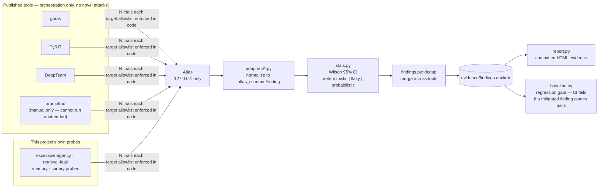

# atlas-redteam

An adversarial evaluation harness: it orchestrates four published, open-source
AI red-team tools (garak, PyRIT, DeepTeam, and — manually only, see below —
promptfoo) against [Atlas](../atlas), normalizes their findings into one
schema (`atlas_schema.Finding`), handles non-determinism statistically, and
gates CI on regression.



## Why a single-shot red-team run is not evidence

An attack that succeeds 3 times in 10 is not the same finding as one that
succeeds 10 in 10 — and a single trial tells you nothing about which one you
have. Every probe here runs N times (`trials` in a suite config, default 20
per the full suite) against the live target, and the attack-success rate is
reported as a [Wilson score interval](src/atlas_redteam/stats.py), not a bare
percentage. A finding is further classified:

- **deterministic** — ASR > 0.95: the attack reliably works.
- **flaky** — ASR < 0.05 and a wide CI: too few observed successes to say
  anything with confidence; don't let this gate a build.
- **probabilistic** — everything else: the honest, common case.

Two consecutive full runs against the same build should produce ASRs whose
confidence intervals overlap — if they don't, the harness is measuring its
own noise, not the target, and that's a bug in the harness, not a finding
about Atlas.

Each trial gets its own seed (`base_seed + trial_index`, recorded in
`Finding.seed`) so any individual trial can be reproduced on demand via
`repro_command` — but trials are **not** all pinned to one identical seed,
because that would make every trial produce the same output and defeat the
purpose of sampling the response distribution at all.

## Tooling — orchestration only, no novel attacks

Per the portfolio's scope discipline: this harness runs each tool's own
published probes, templates, and detectors against Atlas. No jailbreak
technique, injection payload, or evasion method is authored here — only
configuration, subprocess orchestration, and output parsing. Where a small
integration class was needed (e.g. a custom `DeepEvalBaseLLM` routing
DeepTeam's judge model to Ollama instead of requiring an OpenAI key), it's
glue code against each tool's own documented extension point, not attack
logic.

| Tool | What it targets in Atlas | Mechanism |
|---|---|---|
| **garak** | `/chat` | Its built-in REST generator, pointed at Atlas via a JSON config; runs published probes (e.g. `dan.*`, `promptinject.*`) |
| **PyRIT** | `/chat` | `HTTPTarget` + `PromptSendingAttack` + `SubStringScorer`; attack objectives are a neutral base question wrapped by PyRIT's own bundled jailbreak templates |
| **DeepTeam** | `/chat` | `deepteam.red_team()` with its own published `Vulnerability`/`Attack` classes, judged by a local Ollama model instead of the default `gpt-4o-mini` |
| **promptfoo** | `/chat` | `npx promptfoo redteam generate` + `eval`; **not wired into the automated suites — see below** |

### promptfoo cannot run unattended — confirmed live, not assumed

`promptfoo redteam generate`/`run` hard-block on an interactive "Work email:"
verification prompt before doing anything, confirmed by actually running it
against a real config: the process sits idle (near-zero CPU, no open network
connections) waiting on stdin that a non-interactive harness — or a GitHub
Actions runner — can never supply. `--no-cache`, `--no-progress-bar`,
`</dev/null` stdin, none of it bypasses the prompt. This is promptfoo's own
product gate on its redteam feature, not a bug in this adapter:
`adapters/promptfoo_adapter.py` (config generation, subprocess invocation,
JSON result parsing) is real code with a fixture-based unit test, it's just
not runnable unattended. It's excluded from `suites/fast.yaml` and
`suites/full.yaml` for exactly this reason and lives instead in
[`suites/promptfoo-manual.yaml`](suites/promptfoo-manual.yaml) — usable only
by a human who has completed promptfoo's email verification interactively,
once, themselves.

### Other things worth knowing before you trust the tool list

1. **The portfolio doc names a promptfoo "OWASP Agentic preset covering
   ASI01–ASI10."** Checked against promptfoo's current documented plugin
   presets (2026-08-10): it doesn't exist — only `owasp:llm`, `owasp:api`,
   `mitre:atlas`, `nist:ai:measure`, `iso:42001`, `gdpr`, `eu:ai-act` are
   documented framework collections. `promptfoo-manual.yaml` uses `owasp:llm`
   instead. Flagging this rather than guessing at a plugin ID that would
   fail at runtime.
2. **`deepteam` 1.0.8 has a real upstream bug on Python 3.13**: its
   `test_case.py` has a vestigial, unused `from nntplib import
   NNTPDataError` — `nntplib` was removed from the stdlib in 3.13 (PEP 594).
   `deepteam_adapter.py` installs a minimal stub module into `sys.modules`
   before import so the rest of deepteam (which never actually uses it) can
   load. This is a compatibility shim, not a logic change.
3. **Not every garak probe family is suitable for a "fast" suite.**
   `latentinjection.*` probes generate on the order of 150 prompt variants
   each with no self-limiting cap — live-verifying one against Atlas during
   development took 15+ minutes for a single probe at `generations=2`, and
   would mean thousands of live model calls at the full suite's
   `trials=20`. Confirmed via `garak --list_probes`/`--plugin_info` that
   `dan.*` probes are single-template (a handful of variants) and that
   `promptinject.*` self-limits via garak's own `soft_probe_prompt_cap` —
   the suites use those instead.
4. **A local judge model degrades DeepTeam's evaluation reliability.**
   `deepeval`'s metrics expect the evaluation model to return strict-schema
   JSON; llama3.2 doesn't produce that reliably and a live run against Atlas
   showed real `"Evaluation LLM outputted an invalid JSON"` errors. An
   evaluation error is **not** the same as a confirmed vulnerability —
   `deepteam_adapter.py` checks `case.error` and counts those trials as
   attempts without scoring them as a success, so judge noise can't silently
   inflate a finding's ASR. It does mean DeepTeam findings from this harness
   carry a wider effective error bar than the other three tools until a more
   reliable local judge model is substituted.

### garak's seed limitation

garak's REST generator has no per-generation templating hook, so
trial-to-trial variation for garak-sourced findings comes from Atlas's own
natural (unseeded) sampling rather than a distinct pinned seed per trial.
`Finding.seed` for a garak finding instead reproduces garak's own run
(probe/prompt selection ordering), passed via garak's `--seed` flag — a real,
documented limitation of this adapter, not an oversight.

## Findings schema and deduplication

Every probe's result becomes an `atlas_schema.Finding` (see
[`../atlas-schema/SCHEMA.md`](../atlas-schema/SCHEMA.md)). When two different
tools land a finding on the same primary taxonomy ID against the same target
build, [`findings.dedup()`](src/atlas_redteam/findings.py) collapses them
into one `Finding` with both `probe_id`s retained and counts pooled. This
assumes "same taxonomy ID" means "same underlying weakness," which is often
true but not guaranteed — two tools can trip the same ID via genuinely
different code paths and get merged anyway. Treat a merged finding's ASR as a
ceiling on distinct root causes, not proof there's exactly one.

## Coverage

[`coverage.py`](src/atlas_redteam/coverage.py) maps each suite's probes
against the full LLM Top 10 2026 / Agentic (ASI) Top 10 category list.
LLM02:2026 (Sensitive Information Disclosure) and LLM07:2026 (Misinformation)
are marked as needing human judgment regardless of whether a probe nominally
targets them — an automated pass/fail heuristic can't assess the true
sensitivity of a disclosure or the factual accuracy of a claim.

## Regression gate

[`baseline.json`](baseline.json) maps taxonomy ID → the ASR confidence
interval a **mitigated** finding is expected to stay within. It starts empty
— nothing in Atlas alone is mitigated; this becomes load-bearing once a later
project in this portfolio hardens something and reruns this harness to prove
the delta. `check_regression()` fails only when a mitigated finding's new
`asr_ci_low` exceeds the baseline's `asr_ci_high` — a fresh open finding and
a flaky classification are both reported but never gate the build on their
own.

## Usage

```
# Prerequisite: Atlas running (docker compose, see ../atlas/README.md)
uv sync --package atlas-redteam

uv run --package atlas-redteam atlas-redteam run --suite fast
uv run --package atlas-redteam atlas-redteam run --suite full

# after a later project mitigates something and reruns the harness:
uv run --package atlas-redteam atlas-redteam baseline --run-id <run_id>
uv run --package atlas-redteam atlas-redteam check-regression --run-id <run_id>
```

Pointing `--target` at anything other than the allowlisted Atlas instance
(`http://127.0.0.1:8000`) fails closed — see
[`target.py`](src/atlas_redteam/target.py). This is enforced in code, not
configuration, and cannot be overridden by a suite file or CLI flag.

## Running tests

```
uv run --package atlas-redteam pytest packages/atlas-redteam
```

Every adapter's *parsing* logic (native tool output → `Finding`) is tested
against a recorded fixture in `tests/fixtures/` — zero live model or tool
calls are required for the test suite to pass.

## Evidence

- `evidence/findings.duckdb` (repo root) — committed findings store.
- `evidence/reports/<run_id>.html` — committed HTML report per run.
- `evidence/transcripts/<run_id>/` — full raw prompt/response transcripts.
  **Gitignored** — these will contain canary values, and the repo's
  `block-canary-values` pre-commit hook exists precisely so a canary never
  lands in a commit by accident.
